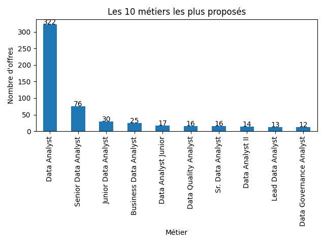
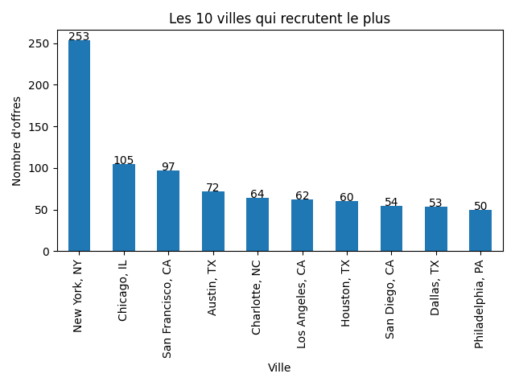
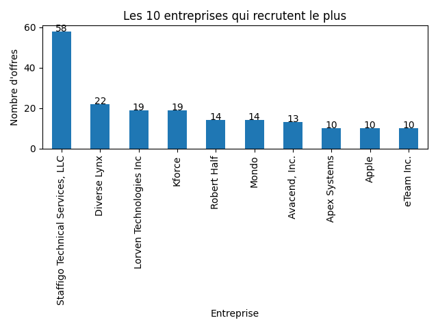
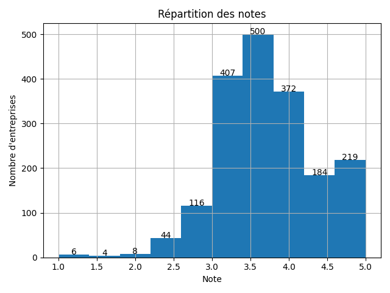
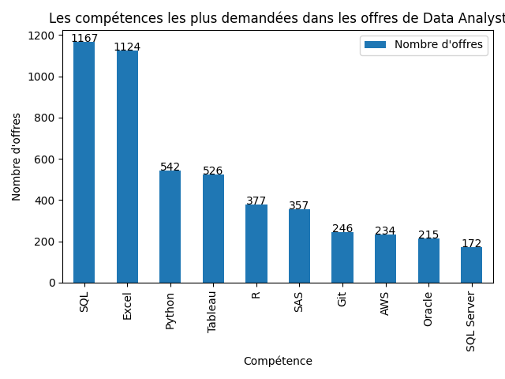
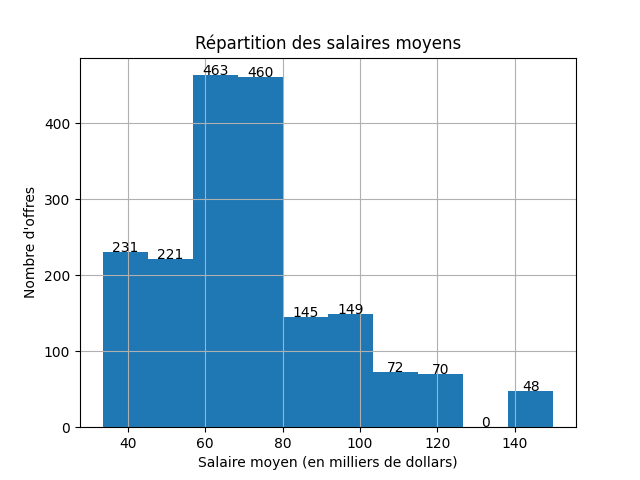

# Analyse des offres d'emploi de Data Analyst

## Introduction

Ce projet consiste à analyser un jeu de données contenant **2 253 offres d'emploi** pour des postes de **Data Analyst**. L'objectif est d'identifier les principales tendances du marché de l'emploi à travers une analyse exploratoire réalisée avec Python.

Les analyses portent notamment sur :
- les métiers les plus recherchés ;
- les secteurs d'activité qui recrutent le plus ;
- les villes où les offres sont les plus nombreuses ;
- les entreprises les plus actives en recrutement ;
- les notes attribuées aux entreprises ;
- les compétences techniques les plus demandées ;
- les estimations de salaires.

L'ensemble des traitements a été réalisé avec les bibliothèques **Pandas** et **Matplotlib**.

## Présentation du jeu de données

Le jeu de données utilisé provient de **Kaggle**. Il regroupe **2 253 offres d'emploi** de Data Analyst et comporte **16 variables** décrivant chaque offre.

Les principales variables sont :

| Variable | Description |
|----------|-------------|
| Job Title | Intitulé du poste |
| Salary Estimate | Estimation du salaire proposé |
| Job Description | Description détaillée de l'offre |
| Rating | Note attribuée à l'entreprise |
| Company Name | Nom de l'entreprise |
| Location | Ville et État de l'offre |
| Headquarters | Siège social de l'entreprise |
| Size | Taille de l'entreprise |
| Founded | Année de création |
| Type of ownership | Type d'organisation |
| Industry | Industrie de l'entreprise |
| Sector | Secteur d'activité |
| Revenue | Chiffre d'affaires estimé |
| Competitors | Principaux concurrents |
| Easy Apply | Indique si la candidature est simplifiée |

## Nettoyage des données

Avant de réaliser les analyses, plusieurs étapes de nettoyage ont été effectuées afin d'améliorer la qualité des données.

Les principales opérations réalisées sont les suivantes :

- Suppression de la colonne **`Unnamed: 0`**, qui correspondait uniquement à un index.
- Suppression des valeurs manquantes ou inutiles, notamment les valeurs **`-1`** présentes dans certaines colonnes.
- Nettoyage de la colonne **Company Name** en supprimant les notes ajoutées à la fin du nom des entreprises (ex. : `Apple 4.1` → `Apple`).
- Nettoyage de la colonne **Salary Estimate** en supprimant les caractères `$`, `K` et les mentions telles que `(Glassdoor est.)`.
- Séparation des salaires minimum et maximum afin de calculer un **salaire moyen** pour chaque offre.

Ces étapes permettent d'obtenir un jeu de données plus propre et plus adapté à l'analyse.

### 1. Les métiers les plus proposés

Le poste de Data Analyst est le plus représenté dans le jeu de données. On observe également des postes proches comme Senior Data Analyst ou Business Data Analyst, ce qui montre qu’il existe plusieurs niveaux d’expérience et spécialisations dans ce domaine.

### 2. Les secteurs d’activité les plus représentés

Les offres d’emploi sont principalement concentrées dans les secteurs de la technologie, de la finance et des services aux entreprises. Ces secteurs utilisent fortement l’analyse de données pour aider à la prise de décision.

### 3. Les villes qui recrutent le plus

Les offres d’emploi sont majoritairement situées dans les grandes villes, où les entreprises sont les plus nombreuses. Cela montre que les opportunités pour les Data Analysts sont principalement concentrées dans les grands pôles économiques.

### 4. Les entreprises qui recrutent le plus

Certaines entreprises publient un nombre plus important d’offres que les autres. Cela montre qu’elles recrutent régulièrement des Data Analysts afin de renforcer leurs équipes ou de développer leurs activités liées à la donnée.

### 5. Répartition des notes des entreprises

La majorité des entreprises possèdent une note comprise entre 3 et 4,5. Les entreprises ayant une note très faible sont peu nombreuses, ce qui montre que la plupart des employeurs sont relativement bien évalués par leurs salariés.

### 6. Les compétences les plus demandées

Les compétences les plus recherchées sont SQL, Excel et Python. Des outils comme Tableau, Power BI et Git apparaissent également dans de nombreuses offres, ce qui montre que les entreprises recherchent des candidats capables de manipuler, analyser et visualiser les données.

### 7. Répartition des salaires moyens

La majorité des offres proposent un salaire moyen situé dans une tranche intermédiaire. Les salaires très faibles ou très élevés sont moins fréquents, ce qui montre que la plupart des offres se concentrent autour d’une rémunération moyenne.

## Conclusion générale

Cette analyse met en évidence les principales caractéristiques des offres d’emploi de Data Analyst. Les résultats montrent que les opportunités sont concentrées dans les grandes villes et dans les secteurs de la technologie et de la finance. Les compétences les plus demandées sont SQL, Excel et Python, tandis que les salaires proposés se situent majoritairement dans une tranche intermédiaire. Cette étude permet ainsi de mieux comprendre les attentes des recruteurs et les compétences à développer pour accéder à ce métier.